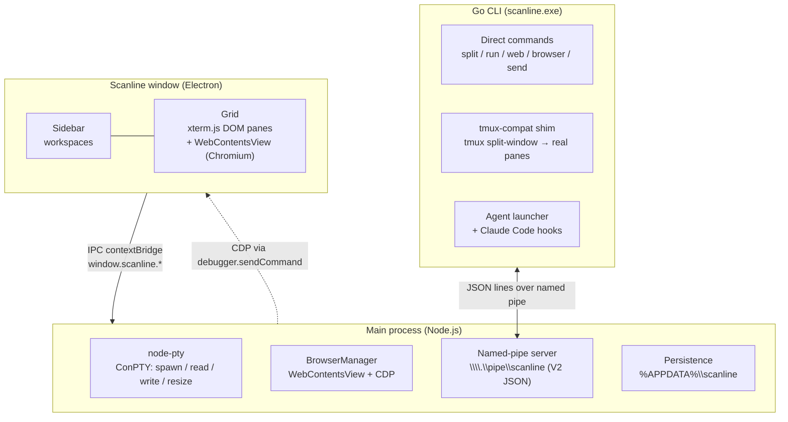

<p align="center"></p>
<h1 align="center">Scanline</h1>
<p align="center">Windows and macOS terminal multiplexer + scriptable browser for AI coding agents.</p>

<p align="center"><a href="README.md">Portugues</a> &middot; <b>English</b></p>

---

Scanline owns one window. Inside it you tile terminal panes and Chromium browser panes side by side, switch contexts with vertical-tab workspaces, and give agents a CDP-scriptable browser so they can snapshot, click, fill, and screenshot a live web app sitting next to the shell that built it.

Windows and macOS: Electron + ConPTY. No WSL, no tmux, no WebView2 dependency.

## What it is and why

**The agent loop Scanline is built for:** the agent edits code in one pane, runs the dev server in another, then snapshots and drives its own web app in an adjacent browser pane via CDP — with risky steps gated by blocking Feed approval cards for human-in-the-loop review.

Key capabilities:

- **Tiling grid** — split right or down, resize, zoom, equalize, and navigate panes with the keyboard.
- **Vertical-tab workspaces** — each workspace shows cwd, git branch + dirty marker, listening ports, and PR status via `gh`.
- **Surface tabs** — multiple terminals stacked in one grid leaf, with drag-reorder.
- **Browser panes** — real Chromium via Electron WebContentsView. Ignores X-Frame-Options, so any site loads. Back/forward/reload, page zoom, and DevTools included.
- **Scriptable browser API** — CDP over `scanline browser`: snapshot interactive elements as `e1`, `e2`, …; click, fill, eval, screenshot, and more. Agents reference elements by tag, not by fragile XPath.
- **Named-pipe control server** — external processes drive the live grid by writing V2 JSON-line requests to `\\.\pipe\scanline` and reading replies back. The Go CLI wraps this for shell use.
- **Agent integration** — `scanline <agent>` launches any agent with a fake-tmux environment so its `tmux split-window` calls become real Scanline panes. Claude Code lifecycle hooks light up pane status dots and post notifications.
- **Feed approval cards** — `scanline ask` blocks until a human clicks a choice; the agent's hook can gate on the reply before proceeding.
- **Session restore** — workspaces, layout tree, cwd, and browser URLs are persisted and restored on launch.
- **Bilingual UI** — Portuguese or English, detected from the OS language on first boot, with a manual override in Settings.
- **Single instance** — a second launch focuses the existing window instead of starting a parallel process.

**How it compares:**

| Tool | Difference |
|---|---|
| cmux (manaflow-ai) | macOS-only, GPL-3.0 |
| wmux | closest Windows alternative — also has a CDP browser; Scanline differs on MIT license, local-first, and a native PT-BR/EN UI |
| Warp | AI is cloud-tied and shell-centric; no agent-driven browser pane |
| Wave Terminal | Browser widget is read-only for the AI, not a CDP-scriptable target |
| Windows Terminal / WezTerm / Tabby | No agent hooks, no scriptable browser, no PR-status sidebar |

Scanline's position: cmux's agent-native UX brought to Windows and macOS — a CDP-scriptable Chromium browser, local-first, MIT, and a native PT-BR/EN UI.

## Install

### Download the installer

From the GitHub Releases page:

**https://github.com/Luizhcrs/scanline/releases/latest**

**Windows:**
- `Scanline Setup <version>.exe` — NSIS installer (recommended). Sets up Start Menu shortcuts.
- `Scanline <version>.exe` — portable. Run directly, no installation required.

Because Scanline is not code-signed yet, Windows SmartScreen will show a "Windows protected your PC" dialog. Click "More info" and then "Run anyway" — the source is fully available in this repository.

**macOS:**
- `Scanline-<version>-arm64.dmg` — Apple Silicon (M1/M2/M3).
- `Scanline-<version>-x64.dmg` — Intel.

On macOS, Gatekeeper may block the app on first launch because it is not notarized yet. Go to System Settings > Privacy & Security and click "Open Anyway".

In-app auto-update is not enabled yet. Grab new versions from the Releases page.

### Build from source

Prerequisites: Node 20+, Go 1.22+.

```powershell
cd app
npm install
npm run dist
```

Output on Windows: `app\dist-installer\` (NSIS installer).
Output on macOS: `app/dist-installer/` (DMG arm64 + x64).

Build the CLI separately:

```sh
cd cli
go build
# Windows: emits scanline.exe
# macOS/Linux: emits scanline
```

Put the binary on your PATH so agents and scripts can reach the running window.

<details>
<summary><b>Features</b></summary>

- Tiling grid: split right/down, resize, zoom, equalize, focus navigation by arrow key.
- Workspaces: vertical-tab sidebar with cwd, git branch + dirty marker, listening ports, linked PR via `gh`.
- Surface tabs: multiple terminals per grid leaf, drag-reorder, jump-to-tab.
- Browser panes: Chromium via WebContentsView (ignores X-Frame-Options), back/forward/reload, page zoom, DevTools.
- Scriptable browser over CDP: `snapshot`, `click`, `fill`, `type`, `eval`, `text`, `html`, `exists`, `wait`, `count`, `find`, `attr`, `value`, `visible`, `checked`, `check`, `uncheck`, `select`, `press`, `scroll`, `zoom`, `viewport`, `cookies`, `storage`, `screenshot`, `navigate`, `back`, `forward`, `reload`, `devtools`.
- Named-pipe control server: V2 JSON-line request/response, for CLI and agents to command and query the live grid.
- Agent integration: fake-tmux launcher, Claude Code lifecycle hooks, Feed approval cards.
- Notifications: per-pane bells, unread badge per workspace, notification panel.
- Session restore: layout, cwd, browser URLs — persisted to `%APPDATA%\scanline\session.json`.
- Bilingual UI: Portuguese / English, auto-detected from the OS on first boot, override via `ui.language` (`auto` / `pt` / `en`); switching applies through a clean relaunch.
- Single instance: a second launch focuses the existing window instead of starting a parallel process.
- Config: JSONC `scanline.json`, live reload on window focus or `scanline config reload`.

</details>

<details>
<summary><b>Keyboard shortcuts</b></summary>

### General

| Shortcut | Action |
|---|---|
| Ctrl+Shift+P | Command palette |
| Ctrl+P | Switch workspace / pane |
| Ctrl+/ | Keyboard shortcuts help |
| Ctrl+, | Settings |
| Ctrl+Shift+M | Minimal mode |
| F11 | Fullscreen |
| Ctrl+B | Toggle sidebar |
| Ctrl+F | Find |
| Ctrl+Shift+F | Find in directory |

### Workspaces

| Shortcut | Action |
|---|---|
| Ctrl+N | New workspace |
| Alt+1..8 | Jump to workspace (Alt+9 = last) |
| Alt+Shift+, / . | Previous / next workspace |

### Panes and splits

| Shortcut | Action |
|---|---|
| Alt+Shift+Right | Split right |
| Alt+Shift+Down | Split down |
| Alt+Shift+B | Open browser pane |
| Alt+Arrows | Move focus between panes |
| Alt+Shift+Z | Zoom pane |
| Alt+Shift+E | Equalize splits |
| Ctrl+Shift+H | Flash focused pane |
| Ctrl+Shift+W | Close pane |

### Tabs (surfaces)

| Shortcut | Action |
|---|---|
| Ctrl+T | New terminal tab |
| Ctrl+W | Close tab |
| Ctrl+Tab / Ctrl+Shift+Tab | Next / previous tab |
| Ctrl+1..9 | Jump to tab |

### Terminal

| Shortcut | Action |
|---|---|
| Ctrl+Shift+K | Clear scrollback |
| Ctrl+= / Ctrl+- / Ctrl+0 | Font size (browser pane: page zoom) |
| Ctrl+Shift+C / V | Copy / paste |
| Ctrl+Shift+A | Select all |

### Notifications

| Shortcut | Action |
|---|---|
| Alt+Shift+N | Notifications panel |
| Alt+Shift+U | Jump to latest unread |

All rebindable actions can be overridden in `scanline.json` under `keybindings`.

</details>

<details>
<summary><b>CLI reference</b></summary>

Scanline must be running. The CLI talks to it over `\\.\pipe\scanline`.

A process running inside a pane inherits `SCANLINE_SURFACE_ID`, so commands like `send`, `status`, and `browser` target the caller's own pane by default — no `--surface` flag needed.

### Layout and panes

```powershell
scanline split [--dir row|col] [-- <command...>]   # split the focused pane
scanline run -- <command...>                       # split and run a command
scanline web <url>                                 # open a browser pane
scanline focus <left|right|up|down>                # move focus
scanline list                                      # list panes (id, kind, focused, rect)
scanline close                                     # close the focused pane
scanline equalize                                  # equalize split sizes
scanline zoom                                      # toggle zoom on focused pane
scanline resize [delta]                            # resize focused pane (default delta: 0.05)
scanline fullscreen                                # toggle fullscreen
```

### Pane I/O

```powershell
scanline read   [--surface N]                      # read scrollback text from a pane
scanline send   [--surface N] <text...>            # send literal text to a pane
scanline key    [--surface N] <key>                # send a key/chord (enter, c-c, up, ...)
scanline status [--surface N] <running|waiting|idle|error>  # set pane status dot
```

### Surface tabs

```powershell
scanline surface new
scanline surface next | prev
scanline surface close
scanline surface select <n>          # 1-based index
scanline surface rename <name>
```

### Workspaces

```powershell
scanline ws list
scanline ws new
scanline ws select <id>
scanline ws close <id>
scanline ws rename <id> <name>
scanline ws current
```

### Notifications

```powershell
scanline notify [--title T] <body...>   # post a notification to a pane
scanline notif                          # list notifications
scanline notif clear                    # clear all notifications
```

### Agent and hooks

```powershell
scanline <agent> [args...]              # launch an agent with fake-tmux environment
scanline claude-teams [args...]         # launch Claude in teammate mode
scanline hooks setup                    # install Claude Code hooks globally (~/.claude/settings.json)
scanline hooks setup --project          # install into ./.claude/settings.json
```

### Misc

```powershell
scanline ask [--title T] [--options a,b,c] <question...>   # blocking approval card; prints choice
scanline config edit                    # open scanline.json in the default editor
scanline config reload                  # reload config live
scanline ping                           # health check
```

</details>

<details>
<summary><b>Scriptable browser API</b></summary>

```powershell
# Navigation
scanline browser open <url>
scanline browser navigate <url> | back | forward | reload
scanline browser devtools

# Inspection
scanline browser snapshot               # tag interactive elements as e1, e2, ...
scanline browser url
scanline browser text [css]
scanline browser html [css]
scanline browser exists <css>
scanline browser wait <css>
scanline browser count <css>
scanline browser find <text...>
scanline browser attr <ref> <name>
scanline browser value <ref>
scanline browser visible <ref>
scanline browser checked <ref>

# Interaction
scanline browser click <ref|css>
scanline browser fill <ref|css> <text...>
scanline browser type <ref|css> <text...>
scanline browser check <ref> | uncheck <ref>
scanline browser select <ref> <value>
scanline browser press <key>
scanline browser scroll [ref]

# Page state
scanline browser eval <js>
scanline browser zoom <factor>
scanline browser viewport <width> <height>
scanline browser cookies [clear]
scanline browser storage [get [key] | set <key> <value> | clear]

# Output
scanline browser screenshot [--out file.png]

# All browser verbs accept --surface N to target a specific browser pane.
```

Example agent loop:

```powershell
scanline run -- npm run dev
scanline web http://localhost:5173
scanline browser snapshot
scanline browser click e7
scanline browser fill e3 "hello@example.com"
scanline browser screenshot --out after.png
```

</details>

<details>
<summary><b>Agent integration</b></summary>

### Fake-tmux launcher

`scanline <agent>` launches any agent binary with a fake-tmux environment: a `tmux.cmd` shim is written to `%USERPROFILE%\.scanline\shim\` and prepended to PATH, and `TMUX` / `TMUX_PANE` are set so the agent believes it is inside a tmux session. When the agent runs `tmux split-window`, the shim forwards it to `scanline __tmux-compat`, which translates it into a real pane split.

Translated tmux verbs: `split-window`, `select-pane`, `kill-pane`, `resize-pane`, `send-keys`, `list-panes`, `capture-pane`, `has-session`.

```powershell
scanline claude             # Claude Code with tmux-compat
scanline claude-teams       # Claude in teammate mode (SCANLINE_CLAUDE_TEAMS=1)
scanline codex              # or any other agent on PATH
```

### Claude Code hooks

Scanline installs these hooks automatically on launch (idempotent). To (re)install manually:

```powershell
scanline hooks setup            # writes to %USERPROFILE%\.claude\settings.json
scanline hooks setup --project  # writes to .\.claude\settings.json
```

| Claude Code event | Pane status |
|---|---|
| UserPromptSubmit | running |
| PreToolUse / PostToolUse | running |
| Notification | waiting + notification posted |
| Stop / SubagentStop | idle |

</details>

<details>
<summary><b>Configuration</b></summary>

Config lives at `%APPDATA%\scanline\scanline.json`. JSONC format. Reloaded live on window focus or `scanline config reload`.

```jsonc
{
  "terminal": {
    "fontFamily": "Consolas, 'Cascadia Mono', monospace",
    "fontSize": 14,
    "scrollback": 10000,
    "theme": {
      "background": "#000000",
      "foreground": "#ffffff",
      "cursor": "#5aa0ff"
    }
  },
  "ui": {
    "fontFamily": "\"Segoe UI Variable Text\", \"Segoe UI\", system-ui, sans-serif",
    "minimal": false,
    "language": "auto"
  },
  "keybindings": {}
}
```

| File | Contents |
|---|---|
| `%APPDATA%\scanline\session.json` | Workspace layout, cwd, browser URLs |

</details>

<details>
<summary><b>Architecture</b></summary>



- **Frontend:** TypeScript + Vite + xterm.js. DOM renderer — WebGL addon wedges the renderer here.
- **PTY:** each terminal pane is a ConPTY via `node-pty`. Data arrives as UTF-8 strings directly over Electron IPC.
- **Browser panes:** `WebContentsView` positioned over the DOM grid. CDP via `webContents.debugger.sendCommand`.
- **Control:** Node.js named-pipe server (`\\.\pipe\scanline`) forwards requests to the renderer and routes replies back.

</details>

<details>
<summary><b>Project layout</b></summary>

```
scanline/
  app/                   Electron application
    index.html           shell + dark splash
    electron/            Main process (Node.js)
      main.ts            BrowserWindow, IPC handlers, subsystem init
      preload.ts         contextBridge — exposes window.scanline to renderer
      pty-manager.ts     node-pty ConPTY wrapper
      browser-manager.ts WebContentsView for browser panes
      control-server.ts  Named-pipe server (Go CLI protocol unchanged)
      app-config.ts      Config and session read/write in %APPDATA%
    src/                 Frontend (TypeScript, xterm.js)
      api.ts             invoke()/listen() shim → window.scanline
      main.ts            App shell: workspaces, shortcuts, control dispatch
      layout.ts          Tiling grid (splits, focus, zoom, serialize)
      pane.ts            Terminal pane (xterm + node-pty via IPC)
      paneContainer.ts   Surface tabs within a grid leaf
      browser.ts         Browser pane (WebContentsView)
      browserApi.ts      Scriptable browser API over CDP
      palette.ts         Command palette + find bar
      contextmenu.ts     Right-click context menu
      overlay.ts         Overlay stack
      feed.ts            Blocking approval cards
      notifications.ts   Notification store + panel
      settings.ts        Settings panel
      config.ts          scanline.json load / merge / apply
      updater.ts         Auto-update (stub)
      types.ts           Shared frontend types
      styles.css         Design tokens + chrome styles
      *.test.ts          Unit tests (Vitest)
    icons/               App icons
  cli/                   Go CLI + tmux-compat shim
    main.go              Command dispatch + pipe RPC
    tmux.go              tmux-compat translation + agent launcher
    browser.go           Scriptable-browser CLI verbs
    hooks.go             Claude Code hook dispatch + setup
    feed.go              Blocking approval (scanline ask)
```

</details>

## License

MIT. Scanline is a clean-room reimplementation of the agent-native terminal UX pioneered by cmux (manaflow-ai/cmux, GPL-3.0). No code is copied from cmux; the behavior of the tmux-compat shim and agent integration is modeled, not derived. See [LICENSE](LICENSE).
