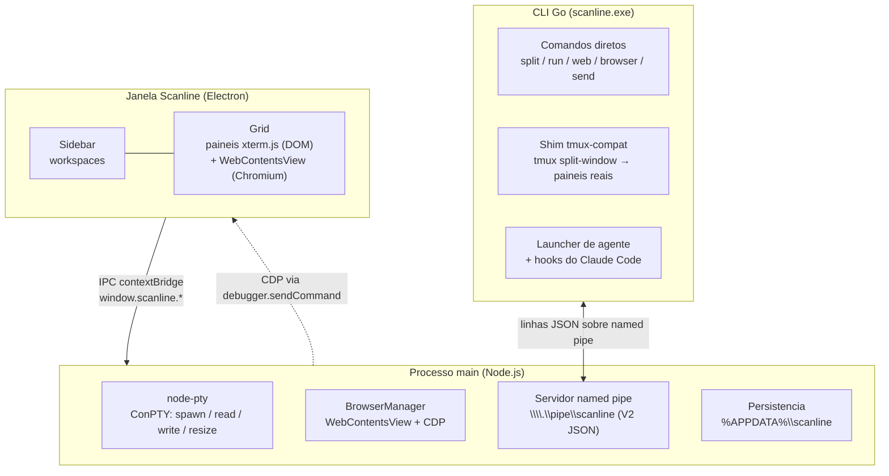

<p align="center"></p>
<h1 align="center">Scanline</h1>
<p align="center">Multiplexador de terminal nativo do Windows + navegador scriptavel para agentes de IA.</p>

<p align="center"><b>Portugues</b> &middot; <a href="README.en.md">English</a></p>

---

Scanline ocupa uma unica janela. Dentro dela voce divide paineis de terminal e paineis de navegador Chromium lado a lado, troca de contexto com workspaces em abas verticais, e da ao agente um navegador scriptavel via CDP — ele tira snapshot, clica, preenche e captura tela de um app web rodando ao lado do shell que o construiu.

Nativo do Windows: Electron + ConPTY. Sem WSL, sem tmux, sem dependencia de WebView2.

## O que e e por que existe

**O loop de agente para o qual o Scanline foi feito:** o agente edita codigo num painel, roda o dev server em outro, depois tira snapshot e dirige o proprio app web num painel de navegador ao lado via CDP — com os passos arriscados barrados por cartoes de aprovacao (Feed) que travam ate um humano revisar.

Capacidades principais:

- **Grid de tiling** — divide pra direita ou pra baixo, redimensiona, zoom, equaliza e navega entre paineis pelo teclado.
- **Workspaces em abas verticais** — cada workspace mostra cwd, branch git + marca de sujo, portas escutando e status de PR via `gh`.
- **Abas de surface** — varios terminais empilhados numa mesma folha do grid, com reordenar arrastando.
- **Paineis de navegador** — Chromium real via Electron WebContentsView. Ignora X-Frame-Options, entao qualquer site carrega. Voltar/avancar/recarregar, zoom de pagina e DevTools inclusos.
- **API de navegador scriptavel** — CDP via `scanline browser`: snapshot dos elementos interativos como `e1`, `e2`, …; click, fill, eval, screenshot e mais. O agente referencia elementos por tag, nao por XPath fragil.
- **Servidor de controle por named pipe** — processos externos dirigem o grid ao vivo escrevendo requisicoes JSON-line V2 em `\\.\pipe\scanline` e lendo as respostas. A CLI em Go embrulha isso pro uso no shell.
- **Integracao com agentes** — `scanline <agente>` sobe qualquer agente num ambiente fake-tmux, entao os `tmux split-window` dele viram paineis Scanline de verdade. Hooks de ciclo de vida do Claude Code acendem os pontos de status do painel e postam notificacoes.
- **Cartoes de aprovacao (Feed)** — `scanline ask` trava ate um humano clicar numa opcao; o hook do agente pode barrar na resposta antes de seguir.
- **Restauracao de sessao** — workspaces, arvore de layout, cwd e URLs do navegador sao persistidos e restaurados ao abrir.
- **UI bilingue** — interface em portugues ou ingles, detectada do idioma do SO no primeiro boot, com override manual nas Configuracoes.
- **Instancia unica** — uma segunda abertura foca a janela existente em vez de subir um processo paralelo.

**Como se compara:**

| Ferramenta | Diferenca |
|---|---|
| cmux (manaflow-ai) | so macOS, GPL-3.0 |
| wmux | alternativa Windows mais proxima — tambem tem navegador CDP; Scanline difere em licenca MIT, local-first e UI PT-BR/EN nativa |
| Warp | IA atrelada a nuvem e centrada no shell; sem painel de navegador dirigido por agente |
| Wave Terminal | o widget de navegador e somente-leitura pra IA, nao um alvo scriptavel via CDP |
| Windows Terminal / WezTerm / Tabby | sem hooks de agente, sem navegador scriptavel, sem sidebar de status de PR |

Posicionamento do Scanline: a UX agent-native do cmux trazida pro Windows — navegador Chromium scriptavel via CDP, local-first, MIT, e UI nativa PT-BR/EN.

## Instalacao

### Baixar o instalador

Na pagina de Releases do GitHub voce encontra o instalador:

**https://github.com/Luizhcrs/scanline/releases/latest**

- `Scanline Setup <versao>.exe` — instalador NSIS (recomendado). Cria atalhos no Menu Iniciar.
- `Scanline <versao>.exe` — portable. Rode direto, sem instalar.

Como o Scanline ainda nao e assinado digitalmente, o Windows SmartScreen vai mostrar o dialogo "O Windows protegeu o computador" ao rodar o instalador. Clique em "Mais informacoes" e depois "Executar mesmo assim".

O auto-update in-app ainda nao esta habilitado. Por enquanto, baixe versoes novas pela pagina de Releases.

### Compilar do codigo-fonte

Pre-requisitos: Node 20+, Go 1.22+.

```powershell
cd app
npm install
npm run dist
```

Saida: `app\dist-installer\` (instalador NSIS).

Compile a CLI separadamente:

```powershell
cd cli
go build
```

Isso gera `scanline.exe`. Coloque no PATH pra que agentes e scripts alcancem a janela em execucao.

<details>
<summary><b>Recursos</b></summary>

- Grid de tiling: divide direita/baixo, redimensiona, zoom, equaliza, navega foco por seta.
- Workspaces: sidebar em abas verticais com cwd, branch git + marca de sujo, portas escutando, PR vinculado via `gh`.
- Abas de surface: varios terminais por folha do grid, reordenar arrastando, pular pra aba.
- Paineis de navegador: Chromium via WebContentsView (ignoram X-Frame-Options), voltar/avancar/recarregar, zoom de pagina, DevTools.
- Navegador scriptavel via CDP: `snapshot`, `click`, `fill`, `type`, `eval`, `text`, `html`, `exists`, `wait`, `count`, `find`, `attr`, `value`, `visible`, `checked`, `check`, `uncheck`, `select`, `press`, `scroll`, `zoom`, `viewport`, `cookies`, `storage`, `screenshot`, `navigate`, `back`, `forward`, `reload`, `devtools`.
- Servidor de controle por named pipe: requisicao/resposta JSON-line V2, pra CLI e agentes comandarem e consultarem o grid ao vivo.
- Integracao com agentes: launcher fake-tmux, hooks de ciclo de vida do Claude Code, cartoes de aprovacao (Feed).
- Notificacoes: bells por painel, badge de nao-lidas por workspace, painel de notificacoes.
- Restauracao de sessao: layout, cwd, URLs do navegador — persistidos em `%APPDATA%\scanline\session.json`.
- UI bilingue: portugues / ingles, auto-detectado do SO no primeiro boot, override em `ui.language` (`auto` / `pt` / `en`); a troca aplica via relaunch limpo.
- Instancia unica: segunda abertura foca a janela existente em vez de subir um processo paralelo.
- Config: `scanline.json` em JSONC, reload ao vivo no foco da janela ou `scanline config reload`.

</details>

<details>
<summary><b>Atalhos de teclado</b></summary>

### Geral

| Atalho | Acao |
|---|---|
| Ctrl+Shift+P | Paleta de comandos |
| Ctrl+P | Trocar workspace / painel |
| Ctrl+/ | Ajuda de atalhos |
| Ctrl+, | Configuracoes |
| Ctrl+Shift+M | Modo minimal |
| F11 | Tela cheia |
| Ctrl+B | Alternar sidebar |
| Ctrl+F | Buscar |
| Ctrl+Shift+F | Buscar no diretorio |

### Workspaces

| Atalho | Acao |
|---|---|
| Ctrl+N | Novo workspace |
| Alt+1..8 | Pular pra workspace (Alt+9 = ultimo) |
| Alt+Shift+, / . | Workspace anterior / proximo |

### Paineis e divisoes

| Atalho | Acao |
|---|---|
| Alt+Shift+Right | Dividir pra direita |
| Alt+Shift+Down | Dividir pra baixo |
| Alt+Shift+B | Abrir painel de navegador |
| Alt+Setas | Mover foco entre paineis |
| Alt+Shift+Z | Zoom no painel |
| Alt+Shift+E | Equalizar divisoes |
| Ctrl+Shift+H | Piscar painel focado |
| Ctrl+Shift+W | Fechar painel |

### Abas (surfaces)

| Atalho | Acao |
|---|---|
| Ctrl+T | Nova aba de terminal |
| Ctrl+W | Fechar aba |
| Ctrl+Tab / Ctrl+Shift+Tab | Proxima / anterior aba |
| Ctrl+1..9 | Pular pra aba |

### Terminal

| Atalho | Acao |
|---|---|
| Ctrl+Shift+K | Limpar scrollback |
| Ctrl+= / Ctrl+- / Ctrl+0 | Tamanho da fonte (painel navegador: zoom de pagina) |
| Ctrl+Shift+C / V | Copiar / colar |
| Ctrl+Shift+A | Selecionar tudo |

### Notificacoes

| Atalho | Acao |
|---|---|
| Alt+Shift+N | Painel de notificacoes |
| Alt+Shift+U | Pular pra ultima nao-lida |

Todas as acoes remapaveis podem ser sobrescritas em `scanline.json` na chave `keybindings`.

</details>

<details>
<summary><b>Referencia da CLI</b></summary>

O Scanline precisa estar rodando. A CLI fala com ele por `\\.\pipe\scanline`.

Um processo rodando dentro de um painel herda `SCANLINE_SURFACE_ID`, entao comandos como `send`, `status` e `browser` miram o proprio painel do chamador por padrao — sem precisar da flag `--surface`.

### Layout e paineis

```powershell
scanline split [--dir row|col] [-- <command...>]   # divide o painel focado
scanline run -- <command...>                       # divide e roda um comando
scanline web <url>                                 # abre um painel de navegador
scanline focus <left|right|up|down>                # move o foco
scanline list                                      # lista paineis (id, tipo, focado, rect)
scanline close                                     # fecha o painel focado
scanline equalize                                  # equaliza tamanhos das divisoes
scanline zoom                                      # alterna zoom no painel focado
scanline resize [delta]                            # redimensiona painel focado (delta padrao: 0.05)
scanline fullscreen                                # alterna tela cheia
```

### I/O de painel

```powershell
scanline read   [--surface N]                      # le texto do scrollback de um painel
scanline send   [--surface N] <text...>            # envia texto literal a um painel
scanline key    [--surface N] <key>                # envia tecla/chord (enter, c-c, up, ...)
scanline status [--surface N] <running|waiting|idle|error>  # define o ponto de status
```

### Abas de surface

```powershell
scanline surface new
scanline surface next | prev
scanline surface close
scanline surface select <n>          # indice base-1
scanline surface rename <name>
```

### Workspaces

```powershell
scanline ws list
scanline ws new
scanline ws select <id>
scanline ws close <id>
scanline ws rename <id> <name>
scanline ws current
```

### Notificacoes

```powershell
scanline notify [--title T] <body...>   # posta notificacao num painel
scanline notif                          # lista notificacoes
scanline notif clear                    # limpa todas as notificacoes
```

### Agente e hooks

```powershell
scanline <agente> [args...]             # sobe um agente em ambiente fake-tmux
scanline claude-teams [args...]         # sobe o Claude em modo teammate
scanline hooks setup                    # instala hooks do Claude Code global (~/.claude/settings.json)
scanline hooks setup --project          # instala em ./.claude/settings.json
```

### Diversos

```powershell
scanline ask [--title T] [--options a,b,c] <question...>   # cartao de aprovacao bloqueante; imprime a escolha
scanline config edit                    # abre scanline.json no editor padrao
scanline config reload                  # recarrega config ao vivo
scanline ping                           # health check
```

</details>

<details>
<summary><b>API de navegador scriptavel</b></summary>

```powershell
# Navegacao
scanline browser open <url>
scanline browser navigate <url> | back | forward | reload
scanline browser devtools

# Inspecao
scanline browser snapshot               # marca elementos interativos como e1, e2, ...
scanline browser url
scanline browser text [css]
scanline browser html [css]
scanline browser exists <css>
scanline browser wait <css>
scanline browser count <css>
scanline browser find <text...>
scanline browser attr <ref> <name>
scanline browser value <ref>
scanline browser visible <ref>
scanline browser checked <ref>

# Interacao
scanline browser click <ref|css>
scanline browser fill <ref|css> <text...>
scanline browser type <ref|css> <text...>
scanline browser check <ref> | uncheck <ref>
scanline browser select <ref> <value>
scanline browser press <key>
scanline browser scroll [ref]

# Estado da pagina
scanline browser eval <js>
scanline browser zoom <factor>
scanline browser viewport <width> <height>
scanline browser cookies [clear]
scanline browser storage [get [key] | set <key> <value> | clear]

# Saida
scanline browser screenshot [--out file.png]

# Todos os verbos browser aceitam --surface N pra mirar um painel de navegador especifico.
```

Exemplo de loop de agente:

```powershell
scanline run -- npm run dev
scanline web http://localhost:5173
scanline browser snapshot
scanline browser click e7
scanline browser fill e3 "hello@example.com"
scanline browser screenshot --out after.png
```

</details>

<details>
<summary><b>Integracao com agentes</b></summary>

### Launcher fake-tmux

`scanline <agente>` sobe qualquer binario de agente num ambiente fake-tmux: um shim `tmux.cmd` e escrito em `%USERPROFILE%\.scanline\shim\` e adicionado ao inicio do PATH, e `TMUX` / `TMUX_PANE` sao setados pra que o agente acredite estar numa sessao tmux. Quando o agente roda `tmux split-window`, o shim encaminha pra `scanline __tmux-compat`, que traduz isso num split de painel real.

Verbos tmux traduzidos: `split-window`, `select-pane`, `kill-pane`, `resize-pane`, `send-keys`, `list-panes`, `capture-pane`, `has-session`.

```powershell
scanline claude             # Claude Code com tmux-compat
scanline claude-teams       # Claude em modo teammate (SCANLINE_CLAUDE_TEAMS=1)
scanline codex              # ou qualquer outro agente no PATH
```

### Hooks do Claude Code

O Scanline instala estes hooks automaticamente na inicializacao (idempotente — so adiciona as proprias entradas e nunca quebra uma config nao-parseavel), pra que os pontos de status do painel e as notificacoes funcionem de cara.

```powershell
scanline hooks setup            # escreve em %USERPROFILE%\.claude\settings.json
scanline hooks setup --project  # escreve em .\.claude\settings.json
```

| Evento do Claude Code | Status do painel |
|---|---|
| UserPromptSubmit | running |
| PreToolUse / PostToolUse | running |
| Notification | waiting + notificacao postada |
| Stop / SubagentStop | idle |

</details>

<details>
<summary><b>Configuracao</b></summary>

A config fica em `%APPDATA%\scanline\scanline.json`. O formato e JSONC. O arquivo e carregado no boot e recarregado ao vivo no foco da janela ou com `scanline config reload`.

```jsonc
{
  "terminal": {
    "fontFamily": "Consolas, 'Cascadia Mono', monospace",
    "fontSize": 14,
    "scrollback": 10000,
    "theme": {
      "background": "#000000",
      "foreground": "#ffffff",
      "cursor": "#5aa0ff"
    }
  },
  "ui": {
    "fontFamily": "\"Segoe UI Variable Text\", \"Segoe UI\", system-ui, sans-serif",
    "minimal": false,
    "language": "auto"
  },
  "keybindings": {}
}
```

| Arquivo | Conteudo |
|---|---|
| `%APPDATA%\scanline\session.json` | Layout de workspace, cwd, URLs do navegador |

</details>

<details>
<summary><b>Arquitetura</b></summary>



- **Frontend:** TypeScript + Vite + xterm.js (renderer DOM — addon WebGL trava o renderer aqui).
- **PTY:** cada painel e um ConPTY via `node-pty`. Dados chegam como string UTF-8 direto pelo IPC do Electron.
- **Browser panes:** `WebContentsView` do Electron posicionada sobre o grid DOM. CDP via `webContents.debugger.sendCommand`.
- **Controle:** servidor named pipe Node.js (`\\.\pipe\scanline`) encaminha requisicoes pro renderer e roteia respostas de volta.

</details>

<details>
<summary><b>Estrutura do projeto</b></summary>

```
scanline/
  app/                   Aplicacao Electron
    index.html           shell + splash escuro
    electron/            Processo main (Node.js)
      main.ts            BrowserWindow, handlers IPC, init dos subsistemas
      preload.ts         contextBridge — expoe window.scanline ao renderer
      pty-manager.ts     node-pty ConPTY
      browser-manager.ts WebContentsView para paineis de navegador
      control-server.ts  Servidor named pipe (protocolo Go CLI inalterado)
      app-config.ts      Leitura/escrita de config e sessao em %APPDATA%
    src/                 Frontend (TypeScript, xterm.js)
      api.ts             Shim invoke()/listen() → window.scanline
      main.ts            Shell do app: workspaces, atalhos, dispatch de controle
      layout.ts          Grid de tiling (splits, foco, zoom, serializacao)
      pane.ts            Painel de terminal (xterm + node-pty via IPC)
      paneContainer.ts   Abas de surface dentro de uma folha do grid
      browser.ts         Painel de navegador (WebContentsView)
      browserApi.ts      API de navegador scriptavel via CDP
      palette.ts         Paleta de comandos + barra de busca
      contextmenu.ts     Menu de contexto
      overlay.ts         Pilha de overlays
      feed.ts            Cartoes de aprovacao bloqueantes
      notifications.ts   Store + painel de notificacoes
      settings.ts        Painel de configuracoes
      config.ts          scanline.json load / merge / apply
      updater.ts         Auto-update (stub)
      types.ts           Tipos compartilhados
      styles.css         Tokens de design + estilos do chrome
      *.test.ts          Testes unitarios (Vitest)
    icons/               Icones do app
  cli/                   CLI Go + shim tmux-compat
    main.go              Dispatch de comandos + RPC por pipe
    tmux.go              Traducao tmux-compat + launcher de agente
    browser.go           Verbos de navegador scriptavel na CLI
    hooks.go             Dispatch + setup dos hooks do Claude Code
    feed.go              Aprovacao bloqueante (scanline ask)
```

</details>

## Licenca

MIT. O Scanline e uma reimplementacao clean-room da UX agent-native de terminal pioneirada pelo cmux (manaflow-ai/cmux, GPL-3.0). Nenhum codigo e copiado do cmux; o comportamento do shim tmux-compat e da integracao com agentes e modelado, nao derivado. Veja [LICENSE](LICENSE).
